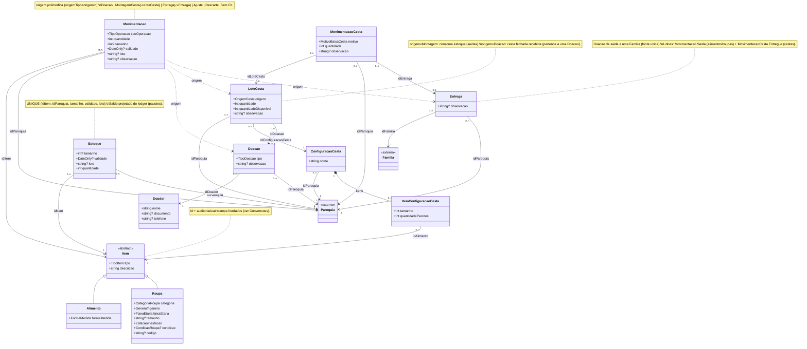

# Modelo de Domínio — Módulo de Estoque (design alvo)

> **Data:** 2026-06-09 · **Revisado:** 2026-06-15
> **Status:** design aprovado em brainstorming; pendente refatoração do código para segui-lo.

> **Revisão 2026-06-15 — novas necessidades da Cáritas.** Ajustes neste modelo, decididos em
> brainstorming a partir do processo real da paróquia:
> - **`Alimento` vira um gênero** (Arroz, Feijão, Farinha…) + **forma de medida** (`FormaMedida`:
>   peso/volume/unidade). A marca deixa de importar; o software já é entregue com gêneros
>   pré-populados e permite cadastrar novos.
> - O **tamanho do pacote** (1kg, 5kg…) é uma **coordenada de lote** em `Estoque`/`Movimentacao`
>   (campo `tamanho`), não atributo do `Alimento` — um mesmo gênero pode coexistir em pacotes de
>   tamanhos diferentes. `quantidade` segue sendo **contagem de pacotes**.
> - Unidades de medida são entendidas **no backend** (`MedidaHelper`): digita-se/exibe-se em kg/L,
>   guarda-se em unidade-base (g/ml/un), e o resumo escolhe a unidade mais legível.
> - Fluxo de **cesta** repensado: `ConfiguracaoCesta` (template reutilizável) + `LoteCesta`
>   (montagem de N cestas iguais, com saldo disponível). A montagem **propõe** os pacotes por
>   validade mais próxima e alerta vencidos; o usuário confirma/ajusta antes da baixa. A
>   `CestaBasica` antiga (saída de 1 cesta com picking manual) é **substituída** por esse fluxo.
> - **Baixa de cestas** está modelada: `LoteCesta.quantidadeDisponivel` é decrementado por um
>   ledger próprio `MovimentacaoCesta` (`MotivoBaixaCesta`: entregue/doada/descartada/outro),
>   espelhando o papel de `Movimentacao` para itens. O **vínculo da entrega a uma `Familia`/
>   beneficiário** é que fica **fora de escopo** desta iteração.

> **Revisão 2026-06-22 — registro unificado de doações de entrada e Entregas de saída.**
> (Detalhe e racional em `design-doacoes-e-entrega-cesta-familia.md`.) Dois ajustes:
> - **`Doacao` vira o registro único de entrada** (mono-tipo `Tipo: TipoDoacao` = `Itens` |
>   `CestasFechadas`). Cestas fechadas recebidas passam a pertencer a uma `Doacao`:
>   `LoteCesta.idDoador` → **`idDoacao`** (doador agora via `Doacao.idDoador`).
> - **Entregas (doações de saída) à `Familia` modeladas** numa entidade `Entrega` (header do
>   evento) cujas linhas debitam os dois ledgers: alimentos/roupas como `Movimentacao` de `Saida`
>   (`origemTipo = Entrega`), cestas como `MovimentacaoCesta` (`motivo = Entregue`, `idEntrega`).
>   `Entrega` é a **fonte única** de tudo que sai para uma família — a baixa de cesta deixa de
>   aceitar `Entregue` e a saída de estoque deixa de ter motivo "Doação". Com isso o vínculo
>   baixa-de-cesta↔`Familia` (antes adiado) é **resolvido** via `Entrega`, e o motivo
>   `MotivoBaixaCesta.Doada` é renomeado para **`Transferida`** (repasse a outra paróquia/órgão).

## Contexto

O código atual do módulo de estoque está bagunçado e foi escrito antes de o modelo
estar claro (FKs nullable mutuamente exclusivas em `Item`, `Doacao`/`MovimentacoesEstoque`
inconsistentes, PKs redundantes, enums com nomes provisórios). Este documento define o
**modelo de domínio alvo**: a referência que o código deve passar a seguir, **não** uma
descrição do que existe hoje. A reconciliação do código com este modelo é trabalho de
implementação posterior (ver [Gap em relação ao código atual](#gap-em-relação-ao-código-atual)).

Escopo: o **módulo de Estoque**. Agregados próprios: `Item` (catálogo), `Estoque` (saldo),
`Movimentacao` (ledger), as causas de movimentação modeladas `Doador`/`Doacao` (entrada) e o
controle de cestas (`ConfiguracaoCesta` + `LoteCesta`, com baixas em `MovimentacaoCesta`), cujas
montagens geram saídas de estoque.

## Princípios

1. **`Movimentacao` é append-only e o único ponto de escrita.** Nada altera `Estoque`
   diretamente. Toda mudança de estoque — interna ou vinda de módulos de outras equipes —
   é um **insert** em `Movimentacao`. É a fronteira de integração do módulo.
2. **`Estoque` é uma projeção mantida do ledger.** A verdade é a soma das movimentações;
   `Estoque` guarda o saldo corrente (cache consultável), reconciliável reprocessando o ledger.
3. **`Item` é o catálogo ("o quê").** Coordenadas físicas de lote (validade, lote, paróquia,
   quantidade) vivem em `Estoque`/`Movimentacao`, nunca em `Item`.
4. **Banco único → toda referência de alvo único tem FK.** `idParoquia`, `idDoador`,
   `idConfiguracaoCesta`, `CriadoPor` etc. são FKs reais, mesmo cruzando módulos (há um só banco). A
   **única** exceção é a origem da movimentação (`origemTipo` + `origemId`): por ser
   **polimórfica** (aponta para `Doacao`, `MontagemCesta`, `Ajuste`, `Descarte`...), não tem
   alvo único e portanto não tem FK.

## Enums

Todos persistidos **como string** no banco (`HasConversion<string>()`): valores estáveis,
legíveis, e crescer o enum não exige cuidado com ordinais nem migration de dados.

| Enum | Valores | Observações |
|------|---------|-------------|
| `TipoItem` | `Alimento`, `Roupa` | Discriminador da hierarquia de `Item`. |
| `TipoOperacao` | `Entrada`, `Saida` | Direção (sinal do delta). Substitui o `Alta`/`Baixa` do código atual. |
| `OrigemMovimentacao` | `Doacao`, `MontagemCesta`, `Ajuste`, `Descarte`, `Utilizacao`, `Entrega` | Motivo/origem. Extensível por outras equipes (relação polimórfica, sem FK). `Doacao` = entrada recebida (`origemId` → `Doacao`); `MontagemCesta` = saída para montagem de cesta (`origemId` → `LoteCesta`); `Entrega` = saída de alimento/roupa entregue a uma família (`origemId` → `Entrega`). |
| `FormaMedida` | `Peso`, `Volume`, `Unidade` | Como o gênero de `Alimento` é medido. Define a unidade-base (g / ml / unidade) e quais unidades de digitação/exibição são válidas. |
| `OrigemCesta` | `Montagem`, `Doacao` | Origem de um `LoteCesta`: `Montagem` = montado do estoque (consome alimentos); `Doacao` = cesta fechada recebida (pertence a uma `Doacao`, via `idDoacao`). |
| `MotivoBaixaCesta` | `Entregue`, `Transferida`, `Descartada`, `Outro` | Motivo da baixa (saída) de cestas do controle, em `MovimentacaoCesta`. `Entregue` = entregue a uma `Familia` (criado só via `Entrega`, com `idEntrega`); `Transferida` = repasse a outra paróquia/órgão. |
| `TipoDoacao` | `Itens`, `CestasFechadas` | Conteúdo de uma `Doacao` (mono-tipo): itens avulsos (linhas de `Movimentacao`) ou cestas fechadas recebidas (`LoteCesta`). |
| `CategoriaRoupa` | `Calca`, `Calcado`, `Acessorio`, `Outro` | Lista ajustável. |
| `FaixaEtaria` | `Infantil`, `Adulto`, ... | Lista ajustável. |
| `Genero` | `Masculino`, `Feminino`, `Unisex` | Usado como nullable em `Roupa`. |
| `Estacao` | `Inverno`, `Verao` | Usado como nullable em `Roupa`. |
| `CondicaoRoupa` | `Novo`, `Usado`, ... | Lista ajustável. Usado como nullable em `Roupa`. |

## Convenções de modelagem

Duas regras aplicadas a **todas** as entidades, para manter o modelo consistente:

1. **Identidade e auditoria são herdadas — não se repetem.** Toda entidade tem, vindo de classes base:
   - `id: int` — PK auto-increment (base `Entity`);
   - `CriadoEm` / `AtualizadoEm` (UTC) — base de timestamps (`AuditableEntity`);
   - `CriadoPor` / `AtualizadoPor` — base de userstamps (convenção a ser extraída numa classe base própria, análoga à de timestamps).

   Esses campos **não** aparecem nas tabelas/diagrama abaixo — só os campos próprios de cada entidade. Subtipos (`Alimento`/`Roupa`) herdam tudo de `Item` e também não redeclaram nada herdado.

   Em concreto, `Item`, `Estoque`, `Doador`, `Doacao`, `ConfiguracaoCesta`, `LoteCesta` e `MovimentacaoCesta` recebem o **conjunto completo**: `CriadoEm`/`AtualizadoEm` + `CriadoPor`/`AtualizadoPor`.

   > Única exceção: `Movimentacao` é **insert-only** — usa apenas `CriadoEm` e `CriadoPor` (este null quando o insert vem de módulo externo); `Atualizado*` nunca são populados.

2. **Referência a outro agregado é por `id`** (DDD: referenciar outros agregados por identidade), não por composição/navegação rica. Nas tabelas de cada entidade as referências são colunas escalares `idXxx`; **no diagrama** elas viram associações com a aresta rotulada pelo nome da coluna (`idItem`, `idParoquia`, `origemId`), deixando as relações visíveis sem repetir a FK dentro da caixa. As caixas mostram só os campos intrínsecos. Entidades de outros módulos (`Paroquia` e a origem polimórfica) aparecem como nós `«externo»`. A única relação de herança é `Item` ◁ `Alimento`/`Roupa`. Cardinalidade e integridade (quais têm FK no banco) ficam na tabela [Relacionamentos](#relacionamentos).

## Entidades

### Item (abstrato) + subtipos — mapeamento **TPT** (Table-per-Type)

Integridade de dados é prioridade sobre performance, por isso TPT: tabela `Item` base +
tabelas `Alimento`/`Roupa` ligadas por FK, com colunas próprias **não-nulas** onde aplicável.
`Estoque`/`Movimentacao` referenciam `Item` genericamente pelo `id`.

**`Item`** (supertipo abstrato)

| Campo | Tipo | Notas |
|-------|------|-------|
| `tipo` | `TipoItem` | Discriminador. |
| `descricao` | string | Rótulo humano do item. Para `Alimento` é o **nome do gênero** (ex.: "Arroz", "Feijão"); para `Roupa`, o rótulo da peça. **Única fonte** — subtipos herdam, não redeclaram. |

**`Alimento` : Item** — representa um **gênero alimentício** (Arroz, Feijão, Farinha…), não uma
marca nem um pacote. O nome do gênero fica em `descricao` (herdado); o tamanho do pacote e a
validade são coordenadas de lote em `Estoque`/`Movimentacao`.

| Campo | Tipo | Notas |
|-------|------|-------|
| `formaMedida` | `FormaMedida` | Como o gênero é medido (peso/volume/unidade). Define a unidade-base e as unidades válidas de digitação/exibição. |

> `descricao` do `Alimento` (nome do gênero) é **única** — não se cadastram dois gêneros "Arroz".
> Gêneros comuns são pré-populados (seed) e novos podem ser cadastrados.

**`Roupa` : Item**

| Campo | Tipo | Notas |
|-------|------|-------|
| `categoria` | `CategoriaRoupa` | |
| `genero` | `Genero?` | nullable |
| `faixaEtaria` | `FaixaEtaria` | |
| `tamanho` | `string?` | nullable; aceita `"GG"`, `"P"`, `"46"`... por isso string, não enum. |
| `estacao` | `Estacao?` | nullable |
| `condicao` | `CondicaoRoupa?` | nullable |
| `codigo` | `string?` | nullable |

> **Decisão de modelagem — `descricao` só no `Item`:** é o mesmo conceito para todo item,
> então mora no supertipo, definido uma vez. Sob TPT, redeclarar em um subtipo criaria uma
> segunda coluna física concorrente. E como `Estoque`/`Movimentacao` referenciam `Item`
> genericamente, listar "todo estoque com sua descrição" precisa funcionar sem saber o
> subtipo — trivial com `descricao` na base. Se um subtipo precisar de outro texto com
> significado distinto, criar campo com nome próprio; nunca sombrear `descricao`.

### Estoque (saldo projetado)

| Campo | Tipo | Notas |
|-------|------|-------|
| `idItem` | int | Referência → `Item`. |
| `idParoquia` | int | Referência → `Paroquia` (fora do módulo). |
| `tamanho` | `int?` | Coordenada de lote: tamanho do pacote em **unidade-base** (g/ml/un). null para itens sem embalagem dimensionada (ex.: Roupa). |
| `validade` | `DateOnly?` | Coordenada de lote; null = sem validade. |
| `lote` | `string?` | Coordenada de lote (identificador escalar); nullable. |
| `quantidade` | int | Saldo corrente desta combinação, em **nº de pacotes**; invariante `>= 0`. |

**Unicidade:** `(idItem, idParoquia, tamanho, validade, lote)` — um saldo por combinação de
item + paróquia + tamanho de pacote + validade + lote.

> **Peso/volume total de um gênero** = `Σ(quantidade × tamanho)` sobre os lotes daquele `Item`,
> formatado pela unidade mais adequada (`MedidaHelper`). É o que alimenta o resumo de estoque.

### Movimentacao (ledger append-only)

| Campo | Tipo | Notas |
|-------|------|-------|
| `idItem` | int | Referência → `Item`. |
| `idParoquia` | int | Paróquia cujo estoque é afetado. |
| `tamanho` | `int?` | Coordenada do lote afetado (tamanho do pacote em unidade-base). |
| `validade` | `DateOnly?` | Coordenada do lote afetado. |
| `lote` | `string?` | Coordenada do lote afetado. |
| `tipoOperacao` | `TipoOperacao` | `Entrada` (+) ou `Saida` (−). |
| `quantidade` | int | Magnitude do movimento; `> 0`. |
| `origemTipo` | `OrigemMovimentacao` | Motivo/origem. |
| `origemId` | `int?` | Referência polimórfica à causa (sem FK — ver Princípio 4). |
| `observacao` | `string?` | Texto livre opcional. |

> `Movimentacao` é **insert-only** (nunca update/delete) e o autor fica em `CriadoPor`
> (herdado) — ver [Convenções de modelagem](#convenções-de-modelagem).

### Doador / Doacao (causas modeladas)

Causas de movimentação modeladas como entidades próprias. Uma `Doacao` (entrada) **não** guarda
itens diretamente: seu "conteúdo" são as linhas de `Movimentacao` que a referenciam via
`origemTipo` + `origemId`. Atributos mínimos (ajustáveis):

**`Doador`**

| Campo | Tipo | Notas |
|-------|------|-------|
| `nome` | string | |
| `documento` | `string?` | CPF/CNPJ; nullable. |
| `telefone` | `string?` | nullable. |

**`Doacao`** (entrada — registro único, mono-tipo)

| Campo | Tipo | Notas |
|-------|------|-------|
| `idDoador` | int | Referência → `Doador` (obrigatório). |
| `idParoquia` | int | Referência → `Paroquia` (paróquia que recebeu). |
| `tipo` | `TipoDoacao` | `Itens` (conteúdo = linhas de `Movimentacao` com `origemTipo=Doacao`) ou `CestasFechadas` (conteúdo = `LoteCesta` com `origem=Doacao`, `idDoacao`). |
| `observacao` | `string?` | nullable. |

### Configuração e montagem de cestas

Substituem a antiga `CestaBasica`. Uma **configuração** é um template reutilizável (que alimentos
e quantos pacotes de cada tamanho uma cesta leva); uma **montagem** cria N cestas iguais a partir
da configuração, consumindo o estoque. As saídas de alimento de uma montagem são linhas de
`Movimentacao` (`origemTipo = MontagemCesta`, `origemId = LoteCesta.id`) — daí se rastreia quais
validades/lotes saíram.

**`ConfiguracaoCesta`** (template)

| Campo | Tipo | Notas |
|-------|------|-------|
| `nome` | string | Ex.: "Cesta A". |
| `idParoquia` | int | Referência → `Paroquia` (escopo da configuração). |

**`ItemConfiguracaoCesta`** (linha do template; sem validade)

| Campo | Tipo | Notas |
|-------|------|-------|
| `idConfiguracaoCesta` | int | Referência → `ConfiguracaoCesta` (dono; cascade). |
| `idAlimento` | int | Referência → `Item` (um `Alimento`). |
| `tamanho` | int | Tamanho do pacote em unidade-base. |
| `quantidadePacotes` | int | Quantos pacotes desse alimento por cesta. |

**`LoteCesta`** (montagem de N cestas / cesta recebida — o "controle de cestas")

| Campo | Tipo | Notas |
|-------|------|-------|
| `idParoquia` | int | Referência → `Paroquia`. |
| `origem` | `OrigemCesta` | `Montagem` ou `Doacao` (recebida fechada). |
| `idConfiguracaoCesta` | `int?` | Referência → `ConfiguracaoCesta` (setado quando `origem = Montagem`). |
| `idDoacao` | `int?` | Referência → `Doacao` (setado quando `origem = Doacao`; doador vem de `Doacao.idDoador`). |
| `quantidade` | int | Nº de cestas do lote. |
| `quantidadeDisponivel` | int | Saldo de cestas ainda não baixadas (inicia = `quantidade`); decrementado por `MovimentacaoCesta`. |
| `observacao` | `string?` | nullable. |

**`MovimentacaoCesta`** (ledger append-only de baixas de cestas)

Espelha o papel de `Movimentacao` para itens, mas no saldo de cestas: registra cada **saída** de N
cestas de um `LoteCesta` (entregues, doadas, descartadas…), decrementando `LoteCesta.quantidadeDisponivel`.
É o **único ponto de baixa** desse saldo — `quantidadeDisponivel` é projeção das baixas, nunca alterado fora daqui.

| Campo | Tipo | Notas |
|-------|------|-------|
| `idLoteCesta` | int | Referência → `LoteCesta` (lote baixado). |
| `idParoquia` | int | Referência → `Paroquia`. |
| `motivo` | `MotivoBaixaCesta` | Por que as cestas saíram. |
| `idEntrega` | `int?` | Referência → `Entrega` (setado quando `motivo = Entregue`; null nos demais). A família vem de `Entrega.idFamilia`. |
| `quantidade` | int | Nº de cestas baixadas; `> 0`. |
| `observacao` | `string?` | nullable. |

> A baixa com `motivo = Entregue` é criada **apenas** via `Entrega` (fonte única), que preenche
> `idEntrega`. Os demais motivos (`Transferida`/`Descartada`/`Outro`) vêm da baixa avulsa do lote.

### Entrega (doação de saída à família)

Registro único de tudo que a Cáritas **entrega a uma `Familia`** — cabeçalho do evento, simétrico à
`Doacao` de entrada. Não guarda itens diretamente: seu "conteúdo" são as linhas nos dois ledgers —
alimentos/roupas como `Movimentacao` de `Saida` (`origemTipo = Entrega`, `origemId = Entrega.id`) e
cestas como `MovimentacaoCesta` (`motivo = Entregue`, `idEntrega = Entrega.id`).

| Campo | Tipo | Notas |
|-------|------|-------|
| `idParoquia` | int | Referência → `Paroquia`. |
| `idFamilia` | int | Referência → `Familia` (beneficiária; da paróquia corrente). |
| `observacao` | `string?` | nullable. |

### Relacionamentos

Toda referência entre entidades é por `id` (sem associação de objeto). Cardinalidade e integridade:

| Campo | Referência | Cardinalidade | FK no banco? |
|-------|-----------|---------------|--------------|
| `Estoque.idItem` | `Item` | N : 1 | Sim |
| `Estoque.idParoquia` | `Paroquia` | N : 1 | Sim |
| `Movimentacao.idItem` | `Item` | N : 1 | Sim |
| `Movimentacao.idParoquia` | `Paroquia` | N : 1 | Sim |
| `Movimentacao.origemId` | polimórfico (via `origemTipo`: `Doacao`/`LoteCesta`/`Entrega`...) | N : 0..1 | **Não** (sem alvo único) |
| `Doacao.idDoador` | `Doador` | N : 1 | Sim |
| `Doacao.idParoquia` | `Paroquia` | N : 1 | Sim |
| `Entrega.idFamilia` | `Familia` | N : 1 | Sim |
| `Entrega.idParoquia` | `Paroquia` | N : 1 | Sim |
| `ConfiguracaoCesta.idParoquia` | `Paroquia` | N : 1 | Sim |
| `ItemConfiguracaoCesta.idConfiguracaoCesta` | `ConfiguracaoCesta` | N : 1 | Sim (cascade) |
| `ItemConfiguracaoCesta.idAlimento` | `Item` | N : 1 | Sim |
| `LoteCesta.idParoquia` | `Paroquia` | N : 1 | Sim |
| `LoteCesta.idConfiguracaoCesta` | `ConfiguracaoCesta` | N : 0..1 | Sim (nullable) |
| `LoteCesta.idDoacao` | `Doacao` | N : 0..1 | Sim (nullable) |
| `MovimentacaoCesta.idLoteCesta` | `LoteCesta` | N : 1 | Sim |
| `MovimentacaoCesta.idParoquia` | `Paroquia` | N : 1 | Sim |
| `MovimentacaoCesta.idEntrega` | `Entrega` | N : 0..1 | Sim (nullable) |
| `*.CriadoPor` / `*.AtualizadoPor` | `Usuario` | N : 1 | Sim |

## Diagrama

## Mecânica ledger → projeção

A cada insert em `Movimentacao`:

1. Resolve (ou cria) a linha de `Estoque` para `(idItem, idParoquia, tamanho, validade, lote)`.
2. Aplica o delta: `Entrada` → `+quantidade`; `Saida` → `−quantidade`.
3. **Invariante:** uma `Saida` não pode levar `Estoque.quantidade` abaixo de 0 — rejeitar
   a movimentação caso contrário.
4. Linhas com saldo 0 são mantidas (histórico), não apagadas.

### Montagem de cesta (propor → confirmar)

A montagem de N cestas a partir de uma `ConfiguracaoCesta` é uma operação em **duas etapas**,
sem alterar estado na primeira:

1. **Simular** — para cada `ItemConfiguracaoCesta`, `necessário = quantidadePacotes × N`. Busca os
   lotes de `Estoque` casando `(idItem, tamanho)` da paróquia, **ordena por validade mais próxima**
   (nulls por último), **alerta os vencidos** e aloca os pacotes até cobrir o necessário; se faltar,
   reporta o faltante. Retorna a proposta de quais pacotes/validades usar.
2. **Confirmar** — recebe as alocações (eventualmente ajustadas pelo usuário) e, numa transação,
   cria o `LoteCesta` (`origem = Montagem`, `quantidadeDisponivel = quantidade`) e insere uma
   `Movimentacao` de `Saida` por alocação (`origemTipo = MontagemCesta`, `origemId = LoteCesta.id`).
   A invariante de saldo da projeção rejeita saídas além do disponível e reverte tudo.

### Baixa de cesta (saída do controle)

Tirar N cestas de um `LoteCesta` é um insert em `MovimentacaoCesta` (`motivo`, `quantidade`) numa
transação que decrementa `LoteCesta.quantidadeDisponivel`. **Invariante:** a baixa não pode levar
`quantidadeDisponivel` abaixo de 0 — rejeitar caso contrário. Espelha o ledger de itens: o saldo de
cestas é projeção das baixas, nunca alterado fora desse caminho. A baixa avulsa cobre só
`Transferida`/`Descartada`/`Outro`; `Entregue` é gerado exclusivamente pela Entrega (abaixo).

### Entrega a uma família (saída cruzando os dois ledgers)

Registrar uma `Entrega` é, numa transação: criar o `Entrega` (header com `idFamilia` validada na
paróquia corrente) e, para cada linha, debitar o ledger correspondente referenciando `Entrega.id` —
alimentos/roupas como `Movimentacao` de `Saida` (`origemTipo = Entrega`), cestas como
`MovimentacaoCesta` (`motivo = Entregue`, `idEntrega`). As mesmas invariantes de saldo
(`Estoque.quantidade >= 0`, `LoteCesta.quantidadeDisponivel >= 0`) valem e revertem tudo se violadas.
É a **fonte única** de saídas a famílias; exige ao menos uma linha.

## Fronteira do módulo / referências externas

Entidades de outros módulos, referenciadas por id **com FK** (banco único), não modeladas aqui:

- **`Paroquia`** — via `idParoquia` (em `Estoque`, `Movimentacao`, `Doacao`, `ConfiguracaoCesta`,
  `LoteCesta`, `Entrega`).
- **`Familia`** — via `Entrega.idFamilia` (beneficiária da entrega).
- **`Usuario`** — via `CriadoPor` / `AtualizadoPor`.

Origens de movimentação **não** modeladas como entidade (referenciadas só por `origemTipo`,
sem linha própria): `Ajuste`, `Descarte` e eventuais causas de outros módulos. A origem `Doacao`
é modelada aqui; a origem `MontagemCesta` aponta (`origemId`) para um `LoteCesta` de montagem.

## Gap em relação ao código atual

O que precisará mudar no código para seguir este modelo (detalhar no plano de implementação):

- `Item`: remover FKs `idAlimento`/`idRoupa`; introduzir hierarquia TPT `Item`→`Alimento`/`Roupa`;
  renomear `nome`→`descricao`; manter `tipo: TipoItem`. Remover o `ItemMeta`/JSON (substituído por subtipos tipados).
- `TipoOperacao`: renomear `Alta`/`Baixa` → `Entrada`/`Saida`.
- `MovimentacoesEstoque` → `Movimentacao`: adicionar `idParoquia`, `lote`, `origemTipo`,
  `origemId`, `observacao`, `criadoPor`; remover FK rígida `idDoacao`; tornar insert-only.
- `Estoque`: índice único `(idItem, idParoquia, tamanho, validade, lote)`; `idParoquia` e `quantidade`
  conforme tabela; lógica de projeção a partir do ledger.
- Modelar `Doador`, `Doacao` (entrada) e o controle de cestas (`ConfiguracaoCesta`/`LoteCesta`,
  com baixas em `MovimentacaoCesta`) como entidades próprias (ajustar a `Doacao` atual, que tem
  shape diferente). A `Doacao` e a `MontagemCesta` (→ `LoteCesta`) são as origens modeladas;
  `Movimentacao` as referencia via `origemTipo`/`origemId` (sem FK), nunca por FK rígida.
- Eliminar os campos `IdItem`/`IdEstoque`/`IdMovimentacao`/`IdDoacao` redundantes com o `Id` herdado.
- Criar a base de userstamps (`CriadoPor`/`AtualizadoPor`) e aplicá-la onde fizer sentido.
- Persistir enums como string.

## Fora de escopo / decisões adiadas

- Listas finais de valores de `CategoriaRoupa`, `FaixaEtaria`, `CondicaoRoupa` (ajustáveis).
- Atributos próprios futuros de `Alimento`, e atributos definitivos de `Doador`/`Doacao` (os atuais são mínimos).
- Estratégia de reconciliação/recálculo do `Estoque` a partir do ledger (job, on-demand).
- Modelagem interna das entidades de outros módulos (`Paroquia`, `Usuario`, `Familia`).

> **Resolvido na revisão 2026-06-22:** o vínculo da saída a uma `Familia` — antes adiado — passou a
> ser modelado pela entidade `Entrega` (header) que liga `Movimentacao`/`MovimentacaoCesta` à família.
